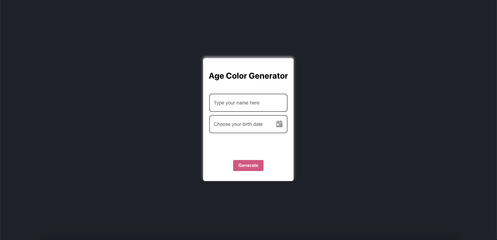
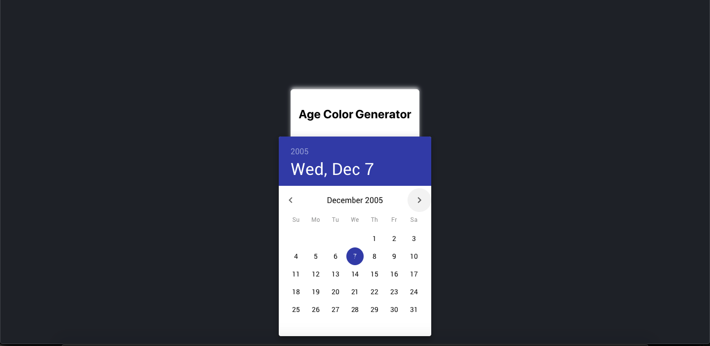
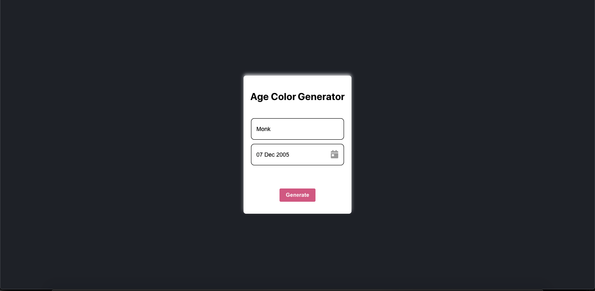
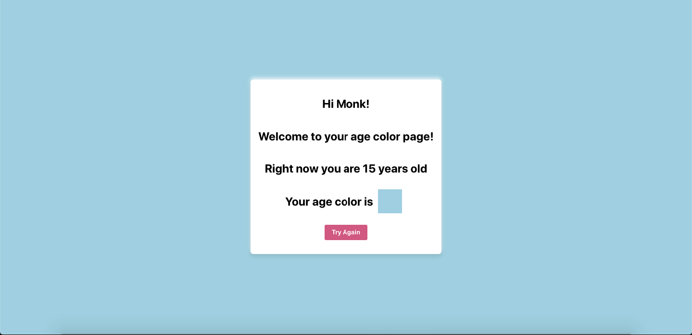

# Xaltius Developer Technical Test: (Front-end)

# Age Color Generator Apps

This repository contains the source code for [Age Color Generator](https://xaltius-fe-test.netlify.app/) front-end web apps. This web apps create with React.

[DEMO](https://xaltius-fe-test.netlify.app/)

## Screenshot

This web apps is responsive to desktop and mobile

### Desktop Resolution

### Mobile Resolution

## Table of contents

<!-- vim-markdown-toc GFM -->

- [Technologies](#technologies)
- [Packages Structure](#packages-structure)
- [Getting Started](#getting-started)
  - [Setting Up](#setting-up)
  - [How To Build](#how-to-build)
  - [How To Run](#how-to-run)
    - [1. Run Jar Natively](#1-run-jar-natively)
    - [2. Use docker](#2-use-docker)
- [Deployment](#deployment)
  - [Setting up the project on Heroku](#setting-up-the-project-on-heroku)
  - [Deploying to Heroku](#deploying-to-heroku)

<!-- vim-markdown-toc -->

## Technologies

- React
- React Router
- Styled Components
- Redux
- Reselect
- Axios
- Material UI date picker

## Packages Structure

- api (API list and utilization)
- components (Base Component)
- config (Configuration)
- pages (Pages component and App Component)
- redux (Redux action, reducer and reselect)

## Getting started

### Setting up

NPM required

- Clone this repository: `git clone hhttps://github.com/bayuagpr/fe-xaltius-test.git`
- Move into the project directory: `cd fe-xaltius-test`
- Install the dependencies: `npm install`

### How to run

- Run the development task: `npm start`

### How to build

- Run build for production: `npm run build`

The app for production will be ready in `build` folder.

## Deployment

- Push code to Github: `git push origin master`

The app will be auto deploy to [https://xaltius-fe-test.netlify.app/](https://xaltius-fe-test.netlify.app/)
